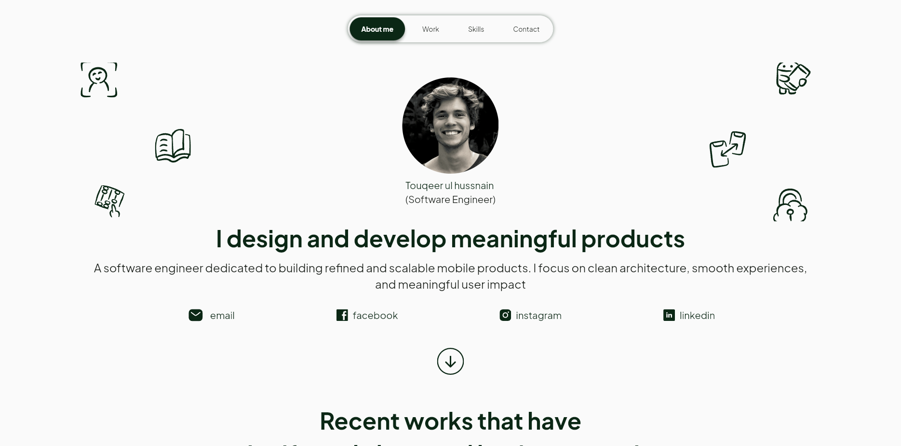
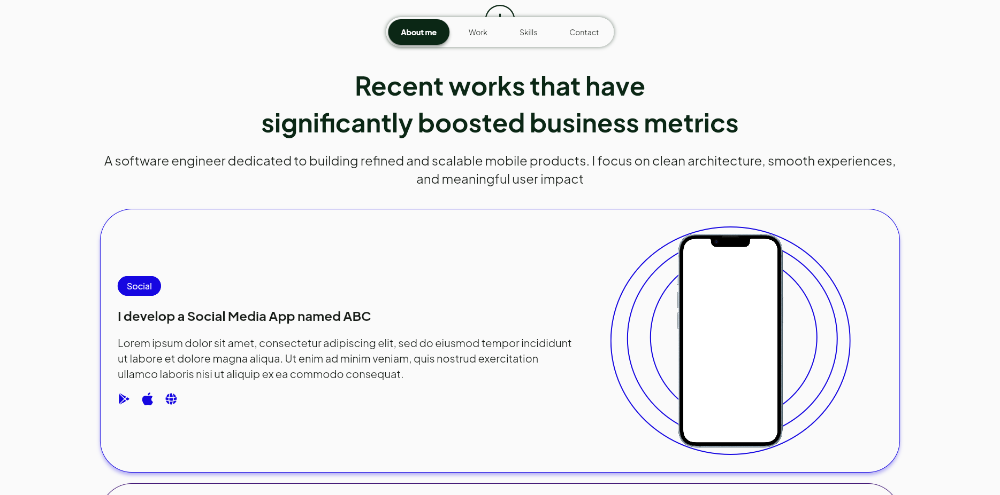
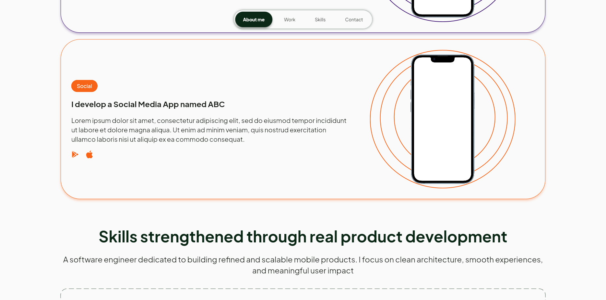
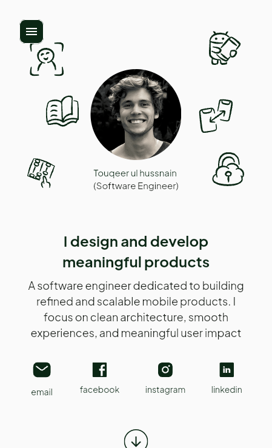
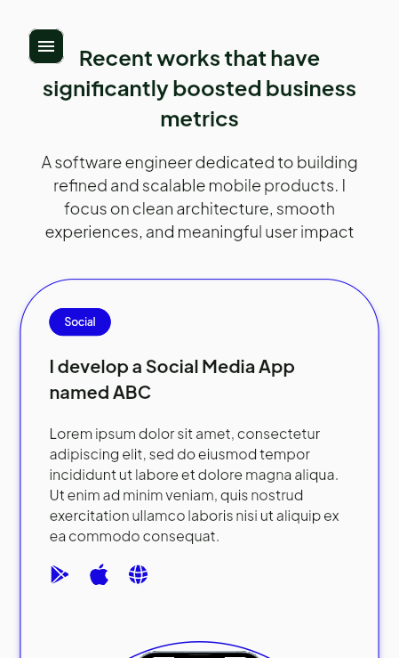
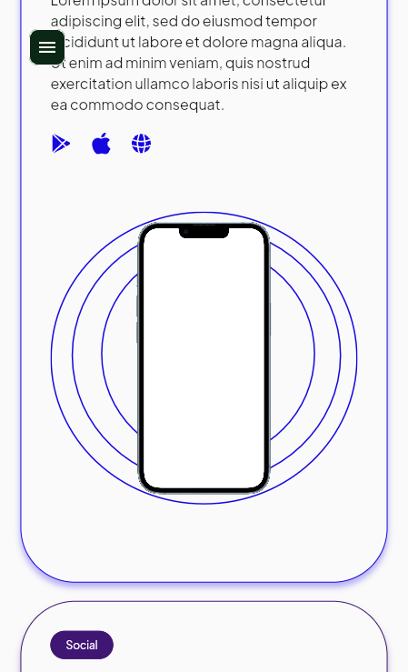
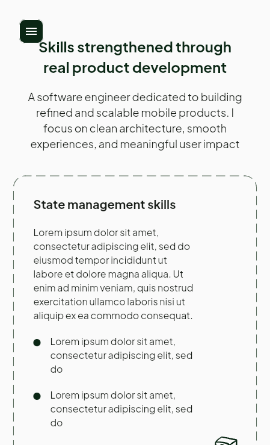
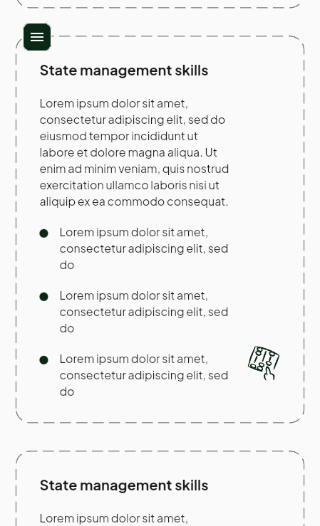
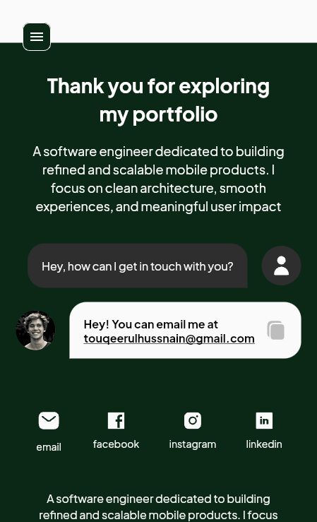

# Responsive Web Flutter Portfolio
A fully responsive Flutter web portfolio built as a single-page application with smooth scrolling, custom animations, and a clean Plus Jakarta Sans UI. Uses GetX for state management and static data. Assets may not all be verified; avoid adding copyrighted or paid assets. GPL-3.0 licensed.


---


## 🔗 Links
LIVE DEMO 👇
- [Live Demo](https://responsive-flutter-portfolio.web.app/)

---

## Table of Contents
- [Features](#features)
- [Getting Started](#getting-started)
- [Running the Project](#running-the-project)
- [Folder Structure](#folder-structure)
- [Asset Notice](#asset-notice)
- [Contributing](#contributing)
- [License](#license)

---

## Features
- 🌐 **Single-page Flutter Web Application**
- 📱 **Fully Responsive** – optimized for mobile, tablet, and desktop
- 🎨 **Custom Design System** – self-designed UI using Plus Jakarta Sans font
- ✨ **Custom Animations** – subtle and smooth animations at multiple sections
- 🧭 **State Management** – GetX for simple and structured state handling
- 🗂 **Static Data Only** – no backend or external API dependencies
- ⚖️ **GPL-3.0 Licensed** – open source, free to use and modify

---

## Getting Started
These instructions will help you run the project locally on your machine.

### Prerequisites
- Flutter installed (stable version recommended)
- A code editor (VS Code, Android Studio, etc.)

---

### Running the Project
1. **Clone the repository**
```bash
git clone https://github.com/<USERNAME>/<REPO>.git
cd <REPO>
```

2. **Install dependencies**
```bash
flutter pub get
```

3. **Run the application**
```bash
flutter run -d chrome
```

---

## Folder Structure
```
lib/
├── main.dart
├── controllers/
├── views/
├── widgets/
└── utils/
```

---

## Screenshots Web View






## Screenshots Mobile View








---

## Asset Notice
This project may contain assets that have not been fully verified for licensing. Please ensure any assets you use comply with their respective licenses and avoid including copyrighted or paid assets without permission.

---

## Contributing
Contributions are welcome! Feel free to open issues or submit pull requests.

---

## License
This project is licensed under the GPL-3.0 License - see the [LICENSE](LICENSE) file for details.

---

## 🔗 Links
Want to connect with me? Reach me here 👇
- [Personal Website](https://touqeerulhussnain.com/)


---
